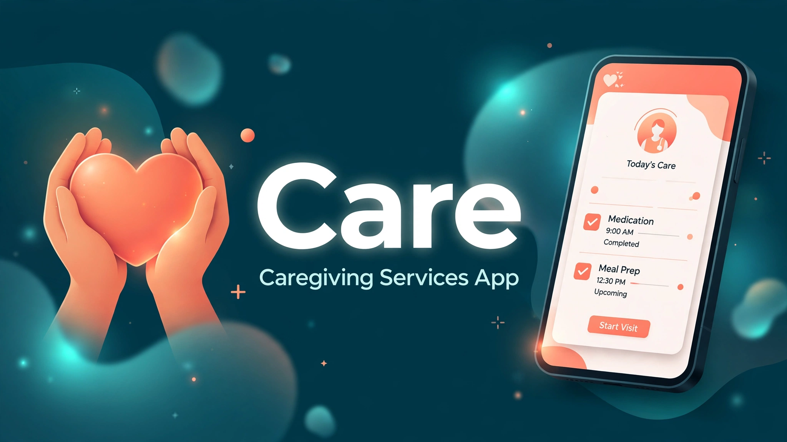

# Care — Caregiving Services App

> ## Status: 🟡 In Progress
>
> <progress value="55" max="100"></progress>
>
> **Progress: 55%** — Core browse screens (home, services, providers, offers) are built; booking flow and backend are still to come

<p align="center">
  
</p>


## What it is

A Flutter mobile app for booking caregiving services — families browse care services, view caregiver profiles, and find top-rated providers. The current codebase covers the discovery side: a home screen, care-service listings with sections, caregiver list items and profile screens, top-providers sections, and offer banners. It's the front end of a caregiving marketplace; booking, payments, and any backend are not yet implemented.

## What works (verified)

- ✅ **Home screen** — 236-line `home_screen.dart` with sections layout
- ✅ **Care services browsing** — listing screen + section widgets + list items
- ✅ **Provider profiles** — caregiver profile screen, top-providers section
- ✅ **Offers UI** — offer banner widgets
- ✅ **Cross-platform scaffold** — android, ios, web, windows, linux, macos targets generated
- ✅ **Clean Dart** — no TODO/FIXME markers in `lib/`

## Tech stack

| Layer | Tech |
|---|---|
| Framework | Flutter (Dart) |
| Platforms | Android, iOS, Web, Windows, Linux, macOS |
| State | (vanilla StatefulWidgets — no state-management package yet) |

## How to run

You need the **Flutter SDK** (not available in this audit environment — verified by code reading instead).

```bash
flutter pub get
flutter run            # debug on a connected device / emulator
flutter build apk      # Android release build
flutter build ios      # iOS release build (macOS + Xcode required)
```

## Screenshots

No screenshots are committed in the repo. The banner above is generated.

## What you can add more

- [ ] **Booking flow** — pick a caregiver, choose a slot, confirm — the core missing feature
- [ ] **Backend + auth** — user accounts, caregiver onboarding, booking storage
- [ ] **Payments** — UPI/cards for the Indian market
- [ ] **State management** — Riverpod/Bloc before the widget tree grows further
- [ ] **Search & filters** — by service type, price, rating, distance
- [ ] **Reviews & verification** — trust badges for caregivers (ID-verified, background-checked)
- [ ] **Screenshots** — run on an emulator and capture the real UI

## Project structure

```
├── lib/
│   ├── main.dart
│   └── screens/
│       ├── home/            # home_screen.dart
│       ├── care_services/   # listing screen, sections, list items
│       ├── providers/       # caregiver_profile_screen, top_providers_section
│       └── offer/           # offer_banner.dart
├── banner.webp
├── pubspec.yaml
└── test/                    # (widget-test scaffold)
```

---
*README written after code audit on 2026-10-08.*
